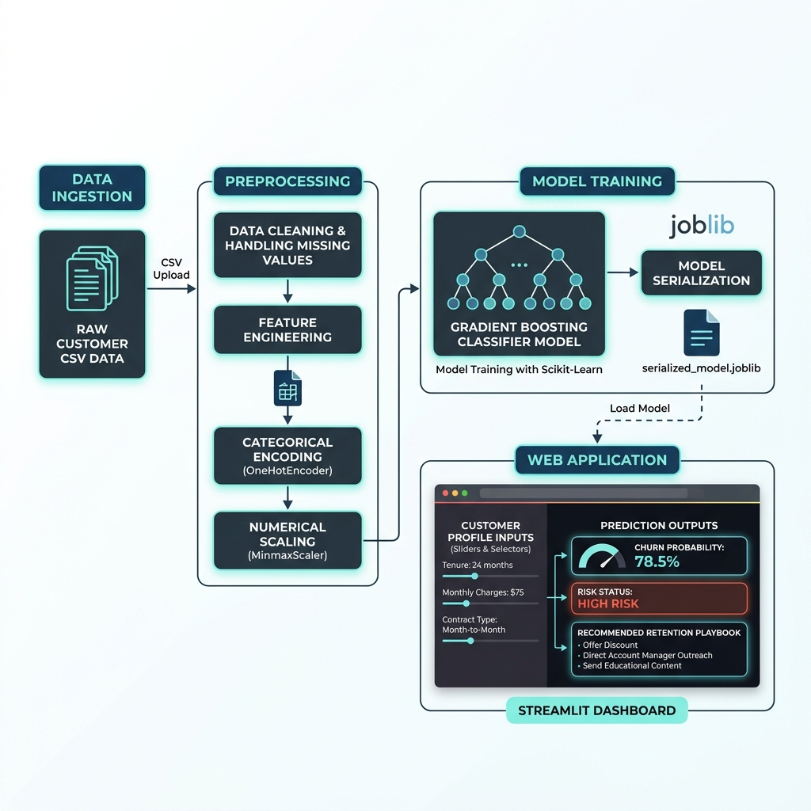

# 📊 Customer Churn Prediction System

An end-to-end Machine Learning system that predicts customer churn probability in real-time, identifies retention friction points, and provides automated playbook recommendations.

[](https://www.python.org/)
[](https://streamlit.io/)
[](https://scikit-learn.org/)
[](https://opensource.org/licenses/MIT)

🚀 **Live Demo:** [Click here to use the app](https://customer-churn-prediction-krohitrkumar.streamlit.app/)

---

## 🔍 System Architecture Overview

The system uses a serialized **Gradient Boosting** pipeline to ingest customer behavioral metrics, process them through transformer pipelines, and output predictions via a premium interactive dashboard interface.



---

## 📁 Dataset & Feature Schema

The underlying model ingests 7 core numerical and categorical parameters representing a customer's engagement, payment standing, and support history:

| Feature / Metric | Data Type | Range / Options | Business Description & Correlation |
| :--- | :--- | :--- | :--- |
| **Tenure** | Numerical (`int64`) | 1 - 72 Months | Months of active service. Strongly negatively correlated with churn. |
| **Support Calls** | Numerical (`float64`)| 0 - 10 Calls | Helpdesk contact volume. Higher counts show customer friction. |
| **Late Payments** | Numerical (`float64`)| 0 - 10 Payments | Count of delayed invoices. Positively correlated with churn risk. |
| **Satisfaction Score**| Numerical (`float64`)| 1 - 10 Scale | Customer feedback rating. Score <= 3 indicates high attrition risk. |
| **Contract Type** | Categorical (`object`)| Monthly, Annual, etc.| Subscription term. Short-term contracts show higher churn velocity. |
| **Payment Method** | Categorical (`object`)| Credit Card, Bank, etc.| Medium of transaction billing. |
| **Region** | Categorical (`object`)| Regional Demographics | Geographic location identifier. |

---

## 🛠️ Tech Stack & Pipeline Components

- **Core Engine**: Python 3.10+, NumPy, Pandas.
- **Machine Learning**: Scikit-Learn 1.5.2 (Pipeline, ColumnTransformer, GradientBoostingClassifier).
- **Visualization**: Matplotlib, Seaborn (Custom high-DPI dashboard themes).
- **Deployment**: Streamlit 1.45.1 (Custom CSS injected theme, HTML indicators, and interactive playbook tables).
- **Serialization**: Joblib (Pipeline packaging).

---

## 🚀 Deployed Application Features

The redesigned user interface divides operations into three high-impact tabs:

### 1. Executive Summary & Overview
- **Metric Cards**: Dynamic KPI grid outlining dataset stats and champion model recall metrics.
- **Friction Highlights**: Clear alert panels detailing dataset insights and risk thresholds.

### 2. High-Resolution Behavior Analysis
- **Aesthetic Visualizations**: Clean, custom boxplots showing customer satisfaction and support tickets distribution.
- **Correlation Matrix**: Custom-designed diverging correlation heatmap detailing how features relate to account termination.

### 3. Customer Churn Predictor
- **Input Profiler**: A dynamic parameter grid summarizing configuration settings.
- **Risk Scorecard**: High-impact glassmorphic status cards indicating risk levels (Low, Moderate, Critical) along with a gradient risk indicator.
- **Retention Playbook**: Dynamic advice panels that trigger specific retention plays based on profile conditions.

---

## 💻 Setup & Running Locally

Follow these instructions to run the customer churn dashboard on your local machine:

### 1. Clone & Navigate
```bash
git clone <repository_url>
cd customer_churn_prediction
```

### 2. Configure Virtual Environment
```bash
# Create environment
python -m venv venv

# Activate on Windows
.\venv\Scripts\activate

# Activate on macOS/Linux
source venv/bin/activate
```

### 3. Install Dependencies
```bash
pip install -r requirements.txt
```

### 4. Execute the Application
```bash
streamlit run churn.py
```
*The portal will launch automatically in your browser at `http://localhost:8501`.*

---

## 🤖 Model Engineering & Comparison

During system design, multiple classification architectures were evaluated. Accuracy and **Recall (Churn Detection)** were the primary validation parameters:

| Classifier Model | Validation Accuracy | Validation Recall | Overfitting Risk | Selection Status |
| :--- | :---: | :---: | :---: | :---: |
| **Logistic Regression** | ~78.4% | ~71.2% | Low | Defeated |
| **AdaBoost** | ~84.1% | ~79.6% | Low | Defeated |
| **Random Forest** | ~86.2% | ~81.0% | Moderate | Defeated |
| **Gradient Boosting** | **~88.2%** | **~86.0%** | **Low** | **🏆 Champion Model** |

> [!TIP]
> **Gradient Boosting** was selected because it delivers optimized recall scores, which is crucial for customer retention (minimizing False Negatives).

---

## 💡 Business Impact

Integrating the Customer Churn Intelligence Portal allows organization leadership to:
- **Minimize Revenue Churn**: Identify high-probability account exits before contract termination.
- **Optimize Outreach**: Focus customer success managers on accounts flagged with critical support call volume.
- **Target Playbooks**: Automate discounts, service check-ins, or onboarding calls based on specific metric thresholds.

---

<details>
<summary>🔮 Future Enhancements (Click to expand)</summary>

- **Real-time API Endpoints**: Introduce FastAPI wrappers to serve prediction endpoints to internal customer relationship systems.
- **Explainable ML (SHAP/LIME)**: Integrate feature importance plots inside the predictor tab to show the *why* behind every customer risk score.
- **Database Connection**: Hook Streamlit inputs directly to a live PostgreSQL or Snowflake instance.

</details>

---

*Developed with ❤️ for Customer Retention & Machine Learning Teams.*
